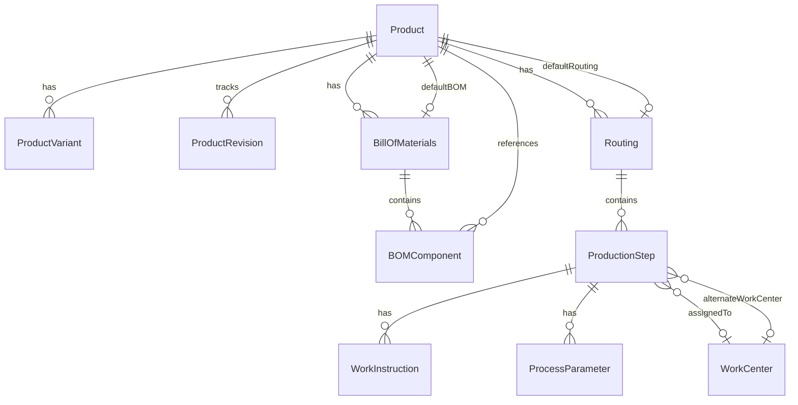

# Product, BOM, and Routing Service Architecture

## Overview

This document describes the service architecture for managing Products, Bill of Materials (BOM), and Routing in the Manufacturing Execution System. The architecture follows a modular, service-oriented design pattern with clear separation of concerns.

## Architecture Principles

1. **Separation of Concerns**: Each service handles a specific domain (Product, BOM, Routing)
2. **Interface-Based Design**: Services implement well-defined interfaces for consistency
3. **Multi-Tenant Support**: All services respect tenant boundaries
4. **Transactional Integrity**: Complex operations use database transactions
5. **Validation First**: Input validation at DTO level before business logic
6. **Event-Driven**: Services emit events for cross-module communication

## Service Layer Structure

```
src/modules/
├── product/
│   ├── interfaces/
│   │   └── product-service.interface.ts
│   ├── dto/
│   │   ├── create-product.dto.ts
│   │   ├── update-product.dto.ts
│   │   └── product-query.dto.ts
│   ├── services/
│   │   ├── product.service.ts
│   │   ├── product-validation.service.ts
│   │   └── product-cost.service.ts
│   └── product.module.ts
├── bom/
│   ├── interfaces/
│   │   └── bom-service.interface.ts
│   ├── dto/
│   │   ├── create-bom.dto.ts
│   │   └── update-bom.dto.ts
│   ├── services/
│   │   ├── bom.service.ts
│   │   ├── bom-cost.service.ts
│   │   └── bom-validation.service.ts
│   └── bom.module.ts
└── routing/
    ├── interfaces/
    │   └── routing-service.interface.ts
    ├── dto/
    │   ├── create-routing.dto.ts
    │   └── update-routing.dto.ts
    ├── services/
    │   ├── routing.service.ts
    │   ├── routing-optimization.service.ts
    │   └── production-step.service.ts
    └── routing.module.ts
```

## 1. Product Service Architecture

### Core Services

#### IProductService
Main service for product management operations:
- **CRUD Operations**: Create, Read, Update, Delete products
- **Variant Management**: Handle product variations (size, color, etc.)
- **Template System**: Quick product creation from templates
- **Revision Control**: Track product changes over time
- **Manufacturing Integration**: Link to BOM and Routing
- **Bulk Operations**: Mass create/update/delete
- **Search & Filter**: Advanced product search capabilities

#### IProductValidationService
Validates product data integrity:
- SKU uniqueness validation
- Barcode format validation
- Manufacturing data consistency
- Cost structure validation
- Dimension and specification validation

#### IProductCostService
Manages product cost calculations:
- Material cost calculation
- Labor cost calculation
- Overhead cost allocation
- Total cost rollup
- Cost breakdown analysis
- Profit margin calculation

### Key Features

1. **Product Templates**
   - Pre-defined product structures
   - Quick product creation
   - Inheritance of specifications

2. **Product Revisions**
   - Complete change history
   - Revert capabilities
   - Audit trail compliance

3. **Manufacturing Integration**
   - Default BOM assignment
   - Default Routing assignment
   - Cost rollup from BOM/Routing

## 2. BOM Service Architecture

### Core Services

#### IBOMService
Manages Bill of Materials operations:
- **BOM Management**: Create, version, and maintain BOMs
- **Component Management**: Add, update, remove components
- **Version Control**: Multiple BOM versions per product
- **BOM Operations**: Copy, explode, implode BOMs
- **Alternate Components**: Substitute component management
- **Material Requirements**: Calculate material needs
- **Availability Check**: Verify component availability

#### IBOMCostService
Handles BOM cost calculations:
- Material cost rollup
- Assembly cost calculation
- Component cost breakdown
- Cost driver analysis
- Saving opportunities identification

#### IBOMValidationService
Ensures BOM data integrity:
- Structure validation (no circular references)
- Component quantity validation
- Completeness checking
- Consistency validation

### Key Features

1. **Multi-Level BOM Support**
   - Hierarchical component structure
   - Phantom components
   - Reference designators

2. **Alternate Components**
   - Primary/alternate relationships
   - Conversion factors
   - Preference ordering

3. **BOM Explosion/Implosion**
   - Where-used analysis
   - Requirements calculation
   - Multi-level expansion

4. **Cost Rollup**
   - Bottom-up cost calculation
   - Include/exclude labor options
   - Cost breakdown by component

## 3. Routing Service Architecture

### Core Services

#### IRoutingService
Manages production routing operations:
- **Routing Management**: Create and maintain routings
- **Production Steps**: Sequential operation management
- **Work Instructions**: Detailed step instructions
- **Process Parameters**: Control parameter management
- **Alternate Routes**: Alternative production paths
- **Capacity Planning**: Resource requirement calculation
- **Time Analysis**: Cycle time and lead time calculation

#### IRoutingOptimizationService
Optimizes production routing:
- Sequence optimization
- Work center load balancing
- Cycle time minimization
- Throughput maximization
- Bottleneck reduction
- Resource utilization optimization

#### IProductionStepService
Manages individual production steps:
- Validation rule management
- Media file attachments
- Quality check definitions
- Parameter validation
- Time and cost calculation
- Bottleneck analysis

### Key Features

1. **Production Step Management**
   - Sequential operations
   - Parallel processing support
   - Step dependencies
   - Critical path identification

2. **Work Center Integration**
   - Primary/alternate work centers
   - Capacity validation
   - Load balancing

3. **Validation Rules**
   - Parameter range checking
   - Pattern validation
   - Custom validation logic
   - Auto-stop on failure

4. **Media & Documentation**
   - Work instruction videos
   - Technical drawings
   - SOPs and documentation
   - Multi-language support

## Service Interaction Patterns

### 1. Product Creation with BOM and Routing
```typescript
// 1. Create Product
const product = await productService.create(productDto);

// 2. Create BOM for Product
const bom = await bomService.create({
  productId: product.id,
  components: [...]
});

// 3. Create Routing for Product
const routing = await routingService.create({
  productId: product.id,
  steps: [...]
});

// 4. Set as defaults
await productService.setDefaultBOM(product.id, bom.id);
await productService.setDefaultRouting(product.id, routing.id);

// 5. Calculate and update costs
await productCostService.updateCosts(product.id);
```

### 2. Cost Calculation Flow
```typescript
// 1. Calculate BOM material cost
const materialCost = await bomCostService.calculateMaterialCost(bomId);

// 2. Calculate routing labor cost
const laborCost = await routingService.calculateCost(routingId, quantity);

// 3. Update product total cost
await productCostService.updateCosts(productId);
```

### 3. Material Requirements Planning
```typescript
// 1. Get BOM requirements
const materials = await bomService.getMaterialRequirements(bomId, quantity);

// 2. Check availability
const availability = await bomService.checkAvailability(bomId, quantity);

// 3. Generate shortage report
if (!availability.available) {
  const shortages = availability.shortages;
  // Handle shortages...
}
```

## Database Relationships



## Transaction Management

Complex operations use database transactions to ensure data consistency:

```typescript
async createProductWithBOM(data: CreateProductWithBOMDto) {
  return await this.dataSource.transaction(async manager => {
    // 1. Create product
    const product = await manager.save(Product, data.product);

    // 2. Create BOM
    const bom = await manager.save(BillOfMaterials, {
      ...data.bom,
      productId: product.id
    });

    // 3. Create components
    for (const component of data.components) {
      await manager.save(BOMComponent, {
        ...component,
        billOfMaterialsId: bom.id
      });
    }

    // 4. Update product with default BOM
    product.defaultBomId = bom.id;
    await manager.save(product);

    return product;
  });
}
```

## Event System

Services emit events for cross-module communication:

```typescript
// Product Events
- ProductCreated
- ProductUpdated
- ProductDeleted
- ProductRevisionCreated

// BOM Events
- BOMCreated
- BOMUpdated
- ComponentAdded
- ComponentRemoved
- BOMVersionCreated

// Routing Events
- RoutingCreated
- RoutingUpdated
- StepAdded
- StepUpdated
- WorkCenterAssigned
```

## Caching Strategy

Frequently accessed data is cached using Redis:

```typescript
// Cache keys
product:{tenantId}:{productId}
product:sku:{tenantId}:{sku}
bom:{tenantId}:{bomId}
bom:exploded:{tenantId}:{bomId}:{quantity}
routing:{tenantId}:{routingId}
routing:steps:{tenantId}:{routingId}
```

## Security Considerations

1. **Tenant Isolation**: All queries filtered by tenantId
2. **Permission Checks**: Role-based access control
3. **Audit Logging**: All changes logged with user info
4. **Data Validation**: Input sanitization and validation
5. **Transaction Isolation**: Proper isolation levels

## Performance Optimizations

1. **Composite Indexes**: Optimized query patterns
2. **Lazy Loading**: Load related data only when needed
3. **Batch Operations**: Bulk insert/update support
4. **Query Optimization**: Use of database views and functions
5. **Caching**: Redis caching for frequent queries

## API Endpoints Structure

```
/api/v1/products
  GET    /                   # List products
  POST   /                   # Create product
  GET    /:id               # Get product
  PUT    /:id               # Update product
  DELETE /:id               # Delete product
  POST   /:id/variants      # Create variant
  POST   /:id/revisions     # Create revision
  POST   /:id/set-default-bom
  POST   /:id/set-default-routing

/api/v1/boms
  GET    /                   # List BOMs
  POST   /                   # Create BOM
  GET    /:id               # Get BOM
  PUT    /:id               # Update BOM
  DELETE /:id               # Delete BOM
  POST   /:id/components    # Add component
  POST   /:id/explode       # Explode BOM
  GET    /:id/cost          # Calculate cost

/api/v1/routings
  GET    /                   # List routings
  POST   /                   # Create routing
  GET    /:id               # Get routing
  PUT    /:id               # Update routing
  DELETE /:id               # Delete routing
  POST   /:id/steps         # Add step
  POST   /:id/optimize      # Optimize routing
  GET    /:id/simulate      # Simulate routing
```

## Testing Strategy

1. **Unit Tests**: Service method testing
2. **Integration Tests**: Service interaction testing
3. **E2E Tests**: Complete workflow testing
4. **Performance Tests**: Load and stress testing
5. **Data Integrity Tests**: Validation and consistency

## Monitoring and Metrics

Key metrics to track:
- Product creation rate
- BOM explosion time
- Routing optimization time
- Cost calculation accuracy
- Material availability checks
- Cache hit rates
- API response times

## Future Enhancements

1. **AI-Powered Optimization**: Machine learning for routing optimization
2. **Real-time Collaboration**: WebSocket support for concurrent editing
3. **Advanced Analytics**: Predictive cost analysis
4. **Integration APIs**: ERP and PLM system integration
5. **Mobile Support**: Offline-capable mobile apps
6. **3D Visualization**: Visual BOM and routing representation