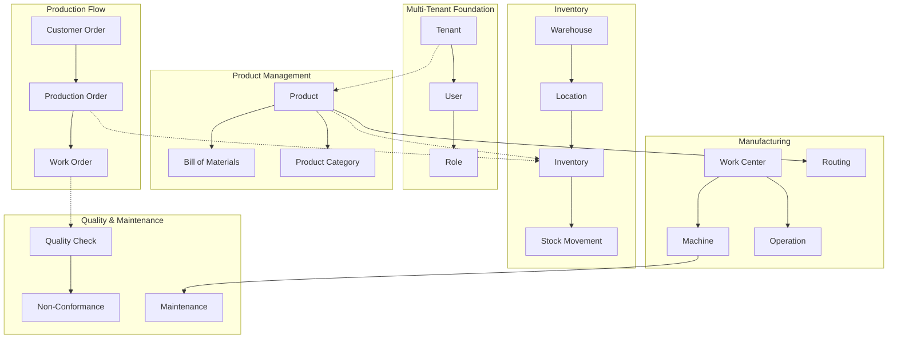

# Manufacturing Execution System - ERD Diagram

## Complete Entity Relationship Diagram

```mermaid
erDiagram
    %% Core Entities
    TENANT {
        uuid id PK
        string name
        string code UK
        string domain UK
        enum status
        jsonb settings
        timestamp created_at
    }
    
    USER {
        uuid id PK
        uuid tenant_id FK
        string email UK
        string username UK
        string first_name
        string last_name
        enum status
        timestamp created_at
    }
    
    ROLE {
        uuid id PK
        uuid tenant_id FK
        string name
        string code UK
        jsonb permissions
        boolean is_system
    }
    
    USER_ROLE {
        uuid id PK
        uuid user_id FK
        uuid role_id FK
        timestamp assigned_at
    }
    
    %% Product Management
    PRODUCT {
        uuid id PK
        uuid tenant_id FK
        string sku UK
        string name
        text description
        uuid category_id FK
        enum type
        decimal cost
        decimal price
        boolean is_active
    }
    
    PRODUCT_CATEGORY {
        uuid id PK
        uuid tenant_id FK
        string code UK
        string name
        uuid parent_category_id FK
    }
    
    BILL_OF_MATERIALS {
        uuid id PK
        uuid tenant_id FK
        uuid product_id FK
        int version
        boolean is_active
        date effective_date
        date expiry_date
    }
    
    BOM_COMPONENT {
        uuid id PK
        uuid bom_id FK
        uuid component_id FK
        decimal quantity
        decimal scrap_percentage
        int sequence
    }
    
    %% Production Planning
    PRODUCTION_ORDER {
        uuid id PK
        uuid tenant_id FK
        string order_number UK
        uuid product_id FK
        decimal quantity_ordered
        decimal quantity_produced
        timestamp planned_start_date
        timestamp planned_end_date
        enum status
        int priority
    }
    
    WORK_ORDER {
        uuid id PK
        uuid tenant_id FK
        string work_order_number UK
        uuid production_order_id FK
        uuid work_center_id FK
        uuid operation_id FK
        int sequence
        decimal quantity_ordered
        decimal quantity_completed
        enum status
    }
    
    %% Manufacturing Execution
    WORK_CENTER {
        uuid id PK
        uuid tenant_id FK
        string code UK
        string name
        uuid department_id FK
        enum type
        decimal capacity_per_hour
        decimal cost_per_hour
        boolean is_active
    }
    
    MACHINE {
        uuid id PK
        uuid tenant_id FK
        uuid work_center_id FK
        string machine_code UK
        string name
        string serial_number
        enum status
        decimal total_operating_hours
    }
    
    OPERATION {
        uuid id PK
        uuid tenant_id FK
        string code UK
        string name
        uuid work_center_id FK
        int setup_time_minutes
        decimal run_time_per_unit_minutes
    }
    
    ROUTING {
        uuid id PK
        uuid tenant_id FK
        uuid product_id FK
        int version
        boolean is_active
        date effective_date
    }
    
    ROUTING_STEP {
        uuid id PK
        uuid routing_id FK
        uuid operation_id FK
        uuid work_center_id FK
        int sequence
        int setup_time_minutes
        decimal run_time_per_unit_minutes
    }
    
    %% Inventory Management
    WAREHOUSE {
        uuid id PK
        uuid tenant_id FK
        string code UK
        string name
        enum type
        decimal capacity
        boolean is_active
    }
    
    LOCATION {
        uuid id PK
        uuid tenant_id FK
        uuid warehouse_id FK
        string code UK
        string name
        enum type
        decimal capacity
    }
    
    INVENTORY {
        uuid id PK
        uuid tenant_id FK
        uuid product_id FK
        uuid warehouse_id FK
        uuid location_id FK
        string lot_number
        decimal quantity_on_hand
        decimal quantity_available
        decimal quantity_reserved
    }
    
    STOCK_MOVEMENT {
        uuid id PK
        uuid tenant_id FK
        string movement_number UK
        enum type
        uuid product_id FK
        decimal quantity
        uuid from_warehouse_id FK
        uuid to_warehouse_id FK
        timestamp performed_at
    }
    
    %% Quality Control
    QUALITY_CHECK {
        uuid id PK
        uuid tenant_id FK
        string check_number UK
        enum type
        uuid work_order_id FK
        uuid product_id FK
        decimal total_quantity
        decimal passed_quantity
        decimal failed_quantity
        enum status
    }
    
    QUALITY_CHECK_ITEM {
        uuid id PK
        uuid quality_check_id FK
        string parameter
        decimal min_value
        decimal max_value
        decimal actual_value
        enum result
    }
    
    NON_CONFORMANCE {
        uuid id PK
        uuid tenant_id FK
        string ncr_number UK
        uuid quality_check_id FK
        uuid product_id FK
        enum severity
        text description
        enum status
    }
    
    %% Maintenance
    MAINTENANCE_SCHEDULE {
        uuid id PK
        uuid tenant_id FK
        uuid machine_id FK
        string schedule_number UK
        enum type
        enum frequency
        date next_due_date
        boolean is_active
    }
    
    MAINTENANCE_ORDER {
        uuid id PK
        uuid tenant_id FK
        string order_number UK
        uuid machine_id FK
        uuid schedule_id FK
        enum type
        enum priority
        enum status
        decimal downtime_hours
    }
    
    %% Supporting Entities
    DEPARTMENT {
        uuid id PK
        uuid tenant_id FK
        string code UK
        string name
        uuid manager_id FK
        uuid parent_department_id FK
    }
    
    UNIT_OF_MEASURE {
        uuid id PK
        uuid tenant_id FK
        string code UK
        string name
        enum category
        decimal conversion_factor
    }
    
    CUSTOMER {
        uuid id PK
        uuid tenant_id FK
        string customer_code UK
        string name
        string email
        string phone
        decimal credit_limit
        boolean is_active
    }
    
    SUPPLIER {
        uuid id PK
        uuid tenant_id FK
        string supplier_code UK
        string name
        string email
        string phone
        int lead_time_days
        boolean is_active
    }
    
    CUSTOMER_ORDER {
        uuid id PK
        uuid tenant_id FK
        string order_number UK
        uuid customer_id FK
        date order_date
        date required_date
        enum status
        decimal total_amount
    }
    
    CUSTOMER_ORDER_LINE {
        uuid id PK
        uuid customer_order_id FK
        int line_number
        uuid product_id FK
        decimal quantity
        decimal unit_price
        decimal total_amount
    }
    
    %% Relationships
    TENANT ||--o{ USER : has
    TENANT ||--o{ PRODUCT : owns
    TENANT ||--o{ WAREHOUSE : manages
    TENANT ||--o{ PRODUCTION_ORDER : creates
    TENANT ||--o{ WORK_CENTER : operates
    
    USER ||--o{ USER_ROLE : has
    ROLE ||--o{ USER_ROLE : assigned_to
    
    PRODUCT ||--o{ BILL_OF_MATERIALS : has
    PRODUCT ||--o{ INVENTORY : stored_as
    PRODUCT ||--o{ ROUTING : manufactured_by
    PRODUCT_CATEGORY ||--o{ PRODUCT : contains
    PRODUCT_CATEGORY ||--o{ PRODUCT_CATEGORY : has_subcategory
    
    BILL_OF_MATERIALS ||--o{ BOM_COMPONENT : contains
    PRODUCT ||--o{ BOM_COMPONENT : used_in
    
    PRODUCTION_ORDER ||--o{ WORK_ORDER : generates
    PRODUCT ||--o{ PRODUCTION_ORDER : produced_by
    
    WORK_CENTER ||--o{ WORK_ORDER : processes
    WORK_CENTER ||--o{ MACHINE : contains
    WORK_CENTER ||--o{ OPERATION : performs
    DEPARTMENT ||--o{ WORK_CENTER : manages
    
    OPERATION ||--o{ WORK_ORDER : executed_in
    
    ROUTING ||--o{ ROUTING_STEP : contains
    OPERATION ||--o{ ROUTING_STEP : included_in
    WORK_CENTER ||--o{ ROUTING_STEP : used_in
    
    WAREHOUSE ||--o{ LOCATION : contains
    WAREHOUSE ||--o{ INVENTORY : stores
    LOCATION ||--o{ INVENTORY : holds
    
    PRODUCT ||--o{ STOCK_MOVEMENT : tracked_by
    WAREHOUSE ||--o{ STOCK_MOVEMENT : from
    WAREHOUSE ||--o{ STOCK_MOVEMENT : to
    
    WORK_ORDER ||--o{ QUALITY_CHECK : inspected_by
    PRODUCT ||--o{ QUALITY_CHECK : checked
    QUALITY_CHECK ||--o{ QUALITY_CHECK_ITEM : contains
    QUALITY_CHECK ||--o{ NON_CONFORMANCE : generates
    
    MACHINE ||--o{ MAINTENANCE_SCHEDULE : scheduled_for
    MACHINE ||--o{ MAINTENANCE_ORDER : maintained_by
    MAINTENANCE_SCHEDULE ||--o{ MAINTENANCE_ORDER : generates
    
    CUSTOMER ||--o{ CUSTOMER_ORDER : places
    CUSTOMER_ORDER ||--o{ CUSTOMER_ORDER_LINE : contains
    PRODUCT ||--o{ CUSTOMER_ORDER_LINE : ordered
    
    SUPPLIER ||--o{ PRODUCT : supplies
    
    DEPARTMENT ||--o{ DEPARTMENT : has_subdepartment
    USER ||--o{ DEPARTMENT : manages
```

## Simplified Core Relationships



## Key Entity Groups

### 1. Core System
- **Tenant**: Multi-tenant isolation
- **User & Role**: Authentication and authorization
- **Department**: Organizational structure

### 2. Product Lifecycle
- **Product**: Master data for all items
- **BOM**: Product composition
- **Routing**: Manufacturing process steps

### 3. Production Management
- **Production Order**: What to make
- **Work Order**: How to make it
- **Work Center**: Where to make it
- **Operation**: Steps to make it

### 4. Inventory Control
- **Warehouse & Location**: Physical storage
- **Inventory**: Current stock levels
- **Stock Movement**: Track all changes

### 5. Quality Assurance
- **Quality Check**: Inspection results
- **Non-Conformance**: Quality issues
- **Corrective Actions**: Resolution tracking

### 6. Maintenance Management
- **Maintenance Schedule**: Preventive maintenance
- **Maintenance Order**: Work to be done
- **Machine Status**: Equipment tracking

## Database Design Principles

1. **Multi-Tenancy**: Every table has tenant_id for data isolation
2. **Audit Trail**: All tables have created_at, updated_at timestamps
3. **Soft Deletes**: Critical data uses deleted_at instead of hard delete
4. **UUID Keys**: All primary keys use UUID for distributed systems
5. **Versioning**: BOM and Routing support multiple versions
6. **Status Tracking**: Enum fields for workflow states
7. **Hierarchical Data**: Self-referential for categories and departments
8. **Temporal Data**: Effective and expiry dates for time-bound data

## Index Strategy

### Primary Indexes
- All primary keys (id)
- All foreign keys (tenant_id, *_id)
- All unique constraints (code, sku, order_number)

### Performance Indexes
- Composite: (tenant_id, status) for filtering
- Composite: (tenant_id, created_at) for sorting
- Composite: (tenant_id, product_id) for lookups

### Full-Text Search
- Product: name, description
- Customer/Supplier: name, address
- Quality: description, notes

## Data Integrity Rules

1. **Referential Integrity**: All foreign keys enforced
2. **Check Constraints**: Quantities >= 0, percentages 0-100
3. **Unique Constraints**: Per tenant for codes/numbers
4. **Date Validations**: Start date <= end date
5. **Status Transitions**: Enforced state machine rules
6. **Inventory Rules**: Available = OnHand - Reserved
7. **BOM Cycles**: Prevent circular dependencies
8. **Version Control**: Only one active version at a time