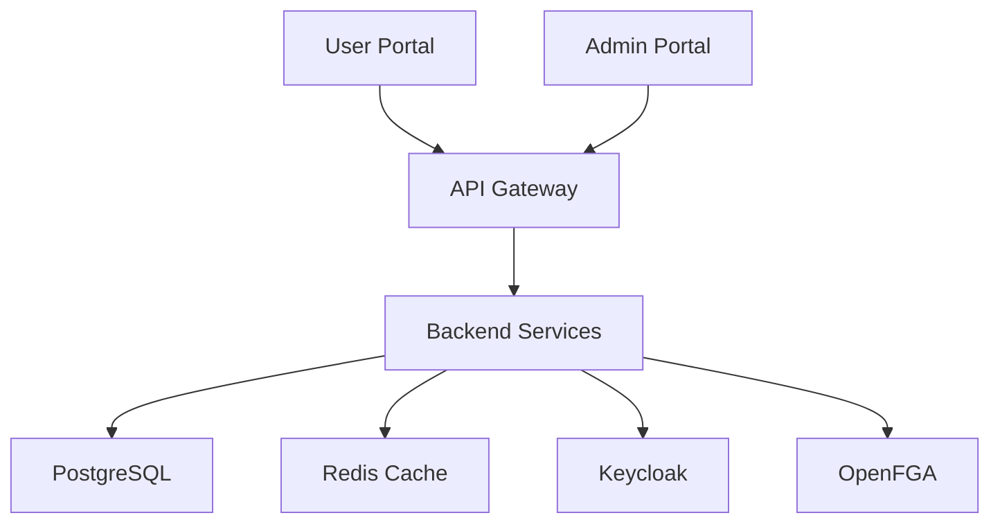

# Full-Stack Enterprise Application Template Generator

## 📝 Project Setup

**Before we begin, let's customize your application:**

Please provide the following information:

1. **Project Name**: What would you like to name your application? ManufacturingExecutionSystem
2. **System Description**: Brief description of what your application does. to help VIP to monitor the flow manufacturing execution from marketing where people sell the end-products then process it in factory assign it to a worker with task lists, each task has input material and output until the end product is meet. also VIP can monitor the inventory for them to know what raw materials we need to buy or re-stocked. in admin portal we have end-product management, worker management and more. the user portal will be used by workers and sales it can be more
3. **Database Name**: What should the database be called? (will be auto-generated as `{project_name_lowercase}_db` if not provided)

---

## 🎯 Project Overview

Create a **production-ready, enterprise-grade full-stack application** called **{PROJECT_NAME}** with modern architecture patterns, comprehensive authentication/authorization, and developer-friendly tooling.

**System Description**: {SYSTEM_DESCRIPTION}

**Key Features:**
- 🏢 Multi-tenant SaaS architecture with data isolation
- 🔐 Enterprise authentication (Keycloak) + fine-grained authorization (OpenFGA)
- 🚀 Dual portal system (Admin + User interfaces)
- 📦 Complete containerized development environment
- 🛠️ Developer workflow automation with Make commands

---

## 🏗️ Architecture Overview

### Core Principles
- **Monorepo Structure**: Organized workspace with shared tooling
- **Container-First Development**: Docker Compose for consistent environments
- **Security by Design**: Zero-trust architecture with JWT + RBAC
- **Scalable Multi-Tenancy**: Tenant isolation at database and application levels
- **Observability**: Built-in logging, monitoring, and audit trails
- **Developer Experience**: Hot reload, automated testing, simplified commands

### System Components


---

## 💻 Technology Stack

### 🛠️ Backend Stack (NestJS)
| Component | Technology | Purpose |
|-----------|------------|---------|
| **Framework** | NestJS (TypeScript, strict mode) | Scalable server-side applications |
| **Database** | PostgreSQL 15 + TypeORM | Primary data persistence + ORM |
| **Cache/Queue** | Redis 7 + Bull | Caching, session store, job queues |
| **Authentication** | Keycloak + `nest-keycloak-connect` | SSO, OAuth2/OIDC, user management |
| **Authorization** | OpenFGA + custom guards | Fine-grained permissions, RBAC |
| **API Documentation** | Swagger/OpenAPI + ReDoc | Interactive API documentation |
| **Security** | Helmet, CORS, rate limiting, bcrypt | Request security, password hashing |
| **Validation** | class-validator + class-transformer | Request/response validation |
| **Testing** | Jest + Supertest + Test containers | Unit, integration, e2e testing |
| **Logging** | Winston + structured logging | Application monitoring |

### 🎨 Frontend Stack (Next.js 15)
| Component | Technology | Purpose |
|-----------|------------|---------|
| **Framework** | Next.js 15 (App Router, RSC) | Modern React framework |
| **Styling** | Tailwind CSS + DaisyUI | Utility-first styling + components |
| **State Management** | Redux Toolkit + TanStack Query | Global state + server state |
| **Forms** | React Hook Form + Zod | Form handling + validation |
| **HTTP Client** | Axios + interceptors | API communication |
| **UI Components** | Radix UI + custom design system | Accessible component library |
| **Authentication** | Keycloak JS adapter | SSO integration, token management |
| **Authorization** | Custom hooks (`usePermission`) | Permission-based UI rendering |
| **Routing** | Next.js App Router | File-based routing |
| **Testing** | Jest + React Testing Library | Component testing |

### 🚀 Infrastructure & DevOps
| Component | Technology | Purpose |
|-----------|------------|---------|
| **Containerization** | Docker + multi-stage builds | Application packaging |
| **Orchestration** | Docker Compose | Local development environment |
| **Identity Provider** | Keycloak (dedicated container) | Authentication service |
| **Authorization Engine** | OpenFGA (dedicated container) | Permission management |
| **Database** | PostgreSQL 15 | Primary database |
| **Cache/Message Broker** | Redis 7 | Caching and queuing |
| **Process Manager** | PM2 (production) | Node.js process management |
| **Reverse Proxy** | Nginx (optional) | Load balancing, SSL termination |

---

## 📁 Project Structure

```
{PROJECT_NAME_KEBAB}/
├── 🏗️ Infrastructure
│   ├── docker-compose.yml           # Multi-service orchestration
│   ├── docker-compose.prod.yml      # Production overrides
│   ├── Makefile                     # Developer workflow commands
│   ├── .env.example                 # Environment configuration template
│   └── nginx/                       # Reverse proxy configuration
│
├── 🛠️ Backend (backend/)
│   ├── src/
│   │   ├── 🔐 auth/                 # Keycloak integration & JWT handling
│   │   ├── 🛡️ permissions/          # OpenFGA integration & guards
│   │   ├── 👥 users/                # User management & profiles
│   │   ├── 🏢 tenants/              # Multi-tenant architecture
│   │   ├── 📋 activities/           # Audit logs & activity tracking
│   │   ├── 🗄️ database/             # DB config, migrations, seeds
│   │   ├── 📤 queues/               # Background job processing
│   │   ├── 📊 health/               # Health checks & monitoring
│   │   ├── 🔧 common/               # Shared utilities & decorators
│   │   └── 📝 swagger/              # API documentation setup
│   ├── test/                        # Test utilities & fixtures
│   │   ├── integration/             # Integration test suites
│   │   ├── e2e/                     # End-to-end test scenarios
│   │   └── fixtures/                # Test data & mocks
│   ├── migrations/                  # Database migration files
│   ├── Dockerfile                   # Multi-stage container build
│   └── package.json
│
├── 🎨 Frontend (frontend/)
│   ├── 🏢 admin-portal/             # Administrative interface
│   │   ├── app/                     # Next.js App Router pages
│   │   │   ├── dashboard/           # Admin dashboard
│   │   │   ├── tenants/             # Tenant management
│   │   │   ├── users/               # User administration
│   │   │   ├── permissions/         # Role & permission management
│   │   │   └── audit/               # Activity logs & reports
│   │   ├── components/              # Admin-specific components
│   │   └── lib/                     # Admin utilities
│   │
│   ├── 👤 user-portal/              # End-user interface
│   │   ├── app/                     # Next.js App Router pages
│   │   │   ├── dashboard/           # User dashboard
│   │   │   ├── profile/             # Profile management
│   │   │   ├── settings/            # User preferences
│   │   │   └── reports/             # User-specific reports
│   │   ├── components/              # User-specific components
│   │   └── lib/                     # User utilities
│   │
│   ├── 📦 packages/                 # Shared packages (monorepo)
│   │   ├── ui/                      # Shared component library
│   │   │   ├── components/          # Reusable UI components
│   │   │   ├── hooks/               # Custom React hooks
│   │   │   ├── utils/               # Utility functions
│   │   │   └── styles/              # Shared styles & themes
│   │   ├── auth/                    # Keycloak integration hooks
│   │   ├── permissions/             # OpenFGA React hooks
│   │   ├── api/                     # API client & types
│   │   └── config/                  # Shared configuration
│   │
│   ├── Dockerfile                   # Multi-stage container build
│   └── package.json
│
├── 📚 Documentation (docs/)
│   ├── api/                         # API documentation
│   ├── deployment/                  # Deployment guides
│   ├── development/                 # Development setup
│   └── architecture/                # System architecture docs
│
└── 🧪 Testing & QA
    ├── .github/workflows/           # CI/CD pipelines
    ├── scripts/                     # Automation scripts
    └── k6/                          # Performance tests
```

---

## 🔧 Developer Workflow (Makefile)

Create a comprehensive **Makefile** at project root for streamlined development:

```makefile
# ===============================
# {PROJECT_NAME} Application Makefile
# ===============================

# Environment Configuration
ENV_FILE=.env
DOCKER_COMPOSE=docker compose --env-file $(ENV_FILE)
DOCKER_COMPOSE_PROD=docker compose -f docker-compose.yml -f docker-compose.prod.yml --env-file $(ENV_FILE)

# Colors for output
RED=\033[0;31m
GREEN=\033[0;32m
YELLOW=\033[1;33m
BLUE=\033[0;34m
NC=\033[0m # No Color

.PHONY: help
help: ## Show this help message
	@echo "$(BLUE){PROJECT_NAME} Application - Available Commands$(NC)"
	@echo ""
	@grep -E '^[a-zA-Z_-]+:.*?## .*$$' $(MAKEFILE_LIST) | awk 'BEGIN {FS = ":.*?## "}; {printf "$(GREEN)%-20s$(NC) %s\n", $$1, $$2}'

# ===============================
# 🚀 Quick Start Commands
# ===============================

.PHONY: setup
setup: ## Initial project setup
	@echo "$(YELLOW)Setting up {PROJECT_NAME} application...$(NC)"
	cp .env.example .env
	$(DOCKER_COMPOSE) pull
	make backend-install
	make frontend-install
	@echo "$(GREEN)✅ Setup complete! Run 'make up' to start services$(NC)"

.PHONY: up
up: ## Start all services (infrastructure + applications)
	@echo "$(BLUE)🚀 Starting all services...$(NC)"
	$(DOCKER_COMPOSE) up -d
	@echo "$(GREEN)✅ All services started!$(NC)"
	@echo "$(YELLOW)📊 Admin Portal: http://localhost:3001$(NC)"
	@echo "$(YELLOW)👤 User Portal: http://localhost:3002$(NC)"
	@echo "$(YELLOW)🔐 Keycloak Admin: http://localhost:8080$(NC)"
	@echo "$(YELLOW)📚 API Docs: http://localhost:3000/api/docs$(NC)"

.PHONY: down
down: ## Stop all services
	@echo "$(RED)🛑 Stopping all services...$(NC)"
	$(DOCKER_COMPOSE) down

# ===============================
# 🛠️ Backend Commands
# ===============================

.PHONY: backend-install
backend-install: ## Install backend dependencies
	cd backend && npm install

.PHONY: backend-dev
backend-dev: ## Run backend in development mode
	cd backend && npm run start:dev

.PHONY: backend-build
backend-build: ## Build backend for production
	cd backend && npm run build

.PHONY: backend-test
backend-test: ## Run backend tests
	cd backend && npm run test

.PHONY: backend-test-e2e
backend-test-e2e: ## Run backend e2e tests
	cd backend && npm run test:e2e

.PHONY: backend-lint
backend-lint: ## Lint backend code
	cd backend && npm run lint

.PHONY: backend-format
backend-format: ## Format backend code
	cd backend && npm run format

.PHONY: db-migrate
db-migrate: ## Run database migrations
	cd backend && npm run migration:run

.PHONY: db-rollback
db-rollback: ## Rollback last database migration
	cd backend && npm run migration:revert

.PHONY: db-seed
db-seed: ## Seed database with initial data
	cd backend && npm run seed

.PHONY: db-reset
db-reset: ## Reset database (drop + migrate + seed)
	cd backend && npm run db:reset

# ===============================
# 🎨 Frontend Commands
# ===============================

.PHONY: frontend-install
frontend-install: ## Install all frontend dependencies
	cd frontend && npm install

.PHONY: admin-dev
admin-dev: ## Run Admin Portal in development mode
	cd frontend/admin-portal && npm run dev

.PHONY: user-dev
user-dev: ## Run User Portal in development mode
	cd frontend/user-portal && npm run dev

.PHONY: frontend-build
frontend-build: ## Build all frontend applications
	cd frontend && npm run build

.PHONY: frontend-test
frontend-test: ## Run frontend tests
	cd frontend && npm run test

.PHONY: frontend-lint
frontend-lint: ## Lint frontend code
	cd frontend && npm run lint

.PHONY: ui-storybook
ui-storybook: ## Start Storybook for UI components
	cd frontend/packages/ui && npm run storybook

# ===============================
# 🔐 Identity & Authorization
# ===============================

.PHONY: keycloak-init
keycloak-init: ## Initialize Keycloak configuration
	@echo "$(BLUE)🔐 Initializing Keycloak...$(NC)"
	$(DOCKER_COMPOSE) exec keycloak /opt/keycloak/bin/kc.sh start-dev
	@echo "$(GREEN)✅ Keycloak initialized!$(NC)"

.PHONY: fga-init
fga-init: ## Initialize OpenFGA schema
	@echo "$(BLUE)🛡️ Initializing OpenFGA...$(NC)"
	$(DOCKER_COMPOSE) exec openfga migrate
	cd backend && npm run fga:seed
	@echo "$(GREEN)✅ OpenFGA initialized!$(NC)"

# ===============================
# 📊 Monitoring & Debugging
# ===============================

.PHONY: logs
logs: ## Follow logs from all services
	$(DOCKER_COMPOSE) logs -f

.PHONY: logs-backend
logs-backend: ## Follow backend logs only
	$(DOCKER_COMPOSE) logs -f backend

.PHONY: logs-db
logs-db: ## Follow database logs
	$(DOCKER_COMPOSE) logs -f postgres

.PHONY: health
health: ## Check health of all services
	@echo "$(BLUE)🔍 Checking service health...$(NC)"
	curl -s http://localhost:3000/health || echo "$(RED)❌ Backend unhealthy$(NC)"
	curl -s http://localhost:8080/health || echo "$(RED)❌ Keycloak unhealthy$(NC)"
	@echo "$(GREEN)✅ Health check complete$(NC)"

# ===============================
# 🧹 Cleanup & Utilities
# ===============================

.PHONY: clean
clean: ## Clean up containers, volumes, and node_modules
	@echo "$(RED)🧹 Cleaning up...$(NC)"
	$(DOCKER_COMPOSE) down -v --remove-orphans
	docker system prune -f
	rm -rf backend/node_modules frontend/node_modules
	rm -rf backend/dist frontend/.next
	@echo "$(GREEN)✅ Cleanup complete!$(NC)"

.PHONY: reset
reset: clean setup ## Complete reset (clean + setup)
	@echo "$(GREEN)✅ Project reset complete!$(NC)"

# ===============================
# 🚢 Production & Deployment
# ===============================

.PHONY: prod-build
prod-build: ## Build production images
	$(DOCKER_COMPOSE_PROD) build

.PHONY: prod-up
prod-up: ## Start production environment
	$(DOCKER_COMPOSE_PROD) up -d

.PHONY: backup-db
backup-db: ## Backup database
	docker exec -t $$($(DOCKER_COMPOSE) ps -q postgres) pg_dump -U postgres -d {DATABASE_NAME} > backup_$$(date +%Y%m%d_%H%M%S).sql
	@echo "$(GREEN)✅ Database backup created$(NC)"

# ===============================
# 📈 Performance & Quality
# ===============================

.PHONY: test-all
test-all: backend-test frontend-test ## Run all tests
	@echo "$(GREEN)✅ All tests completed!$(NC)"

.PHONY: lint-all
lint-all: backend-lint frontend-lint ## Lint all code
	@echo "$(GREEN)✅ All code linted!$(NC)"

.PHONY: perf-test
perf-test: ## Run performance tests with k6
	k6 run k6/load-test.js
```

---

## 🚀 Quick Start Guide

### Initial Setup
```bash
# Clone and setup project
git clone <repository-url>
cd {PROJECT_NAME_KEBAB}
make setup                    # Copy .env, install dependencies
```

### Development Workflow  
```bash
# Start infrastructure (Postgres, Redis, Keycloak, OpenFGA)
make up

# Initialize identity services
make keycloak-init
make fga-init

# Run applications (in separate terminals)
make backend-dev             # API Server (http://localhost:3000)
make admin-dev               # Admin Portal (http://localhost:3001)  
make user-dev                # User Portal (http://localhost:3002)

# Database operations
make db-migrate              # Run migrations
make db-seed                 # Seed initial data
```

### Testing & Quality
```bash
make test-all                # Run all tests
make lint-all                # Lint all code
make health                  # Check service health
```

### Production Deployment
```bash
make prod-build              # Build production images
make prod-up                 # Start production environment
make backup-db               # Backup database
```

---

## ✨ Key Implementation Features

### 🔐 **Authentication & Authorization**
- **Single Sign-On**: Keycloak integration with OAuth2/OIDC
- **Fine-grained Permissions**: OpenFGA for relationship-based access control
- **JWT Tokens**: Secure service-to-service communication
- **Multi-tenant Isolation**: Tenant-specific data and permissions

### 🏗️ **Architecture Patterns**
- **Clean Architecture**: Separation of concerns with dependency injection
- **CQRS**: Command Query Responsibility Segregation where applicable  
- **Event Sourcing**: Activity tracking and audit logs
- **Repository Pattern**: Database abstraction layer

### 🚀 **Developer Experience**
- **Hot Reload**: Instant development feedback
- **Type Safety**: End-to-end TypeScript coverage
- **API Documentation**: Auto-generated Swagger/OpenAPI docs
- **Testing**: Comprehensive test suites with fixtures
- **Linting**: Consistent code quality with ESLint/Prettier

### 📊 **Production Ready**
- **Health Checks**: Service monitoring and alerting
- **Structured Logging**: Winston with correlation IDs
- **Error Handling**: Centralized error management
- **Rate Limiting**: API protection and abuse prevention
- **Security Headers**: Helmet.js security middleware

---

## 🔧 Implementation Instructions

When implementing this template, replace the following placeholders throughout all generated files:

### **Variable Replacements**
- `{PROJECT_NAME}` → Your project name (e.g., "TaskMaster")
- `{PROJECT_NAME_KEBAB}` → Kebab-case version (e.g., "task-master")  
- `{PROJECT_NAME_SNAKE}` → Snake_case version (e.g., "task_master")
- `{PROJECT_NAME_CAMEL}` → CamelCase version (e.g., "taskMaster")
- `{PROJECT_NAME_PASCAL}` → PascalCase version (e.g., "TaskMaster")
- `{SYSTEM_DESCRIPTION}` → Your system description
- `{DATABASE_NAME}` → Database name (defaults to `{PROJECT_NAME_SNAKE}_db`)

### **Files to Customize**
1. **package.json files**: Update `name`, `description`, and `repository` fields
2. **docker-compose.yml**: Update service names and database names
3. **README.md**: Replace project name and description
4. **Environment files**: Update application names and database connections
5. **Keycloak configuration**: Update realm names and client IDs
6. **OpenFGA models**: Update application-specific object types and relations

### **Additional Customizations**
- Update port numbers if conflicts exist in your development environment
- Modify database schema names to match your organization's conventions  
- Customize Keycloak themes and branding
- Adjust OpenFGA permission models for your specific use cases
- Configure CI/CD pipeline variables for your deployment environment
