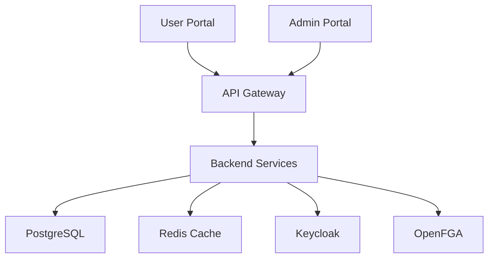

# Product Requirements Document: Manufacturing Execution System

## Introduction/Overview

The Manufacturing Execution System (MES) is a comprehensive production management platform designed to streamline the entire manufacturing workflow from sales orders to product delivery. This system addresses the critical need for real-time visibility into production processes, inventory management, and workforce coordination. It enables executives to monitor manufacturing operations, helps supervisors assign and track tasks efficiently, empowers workers to complete their assignments with clarity, and allows sales teams to manage orders seamlessly.

## 🎯 Project Overview

Create a **production-ready, enterprise-grade full-stack application** called **{PROJECT_NAME}** with modern architecture patterns, comprehensive authentication/authorization, and developer-friendly tooling.

**System Description**: {SYSTEM_DESCRIPTION}

**Key Features:**
- 🏢 Multi-tenant SaaS architecture with data isolation
- 🔐 Enterprise authentication (Keycloak) + fine-grained authorization (OpenFGA)
- 🚀 Dual portal system (Admin + User interfaces)
- 📦 Complete containerized development environment
- 🛠️ Developer workflow automation with Make commands

---

## 🏗️ Architecture Overview

### Core Principles
- **Monorepo Structure**: Organized workspace with shared tooling
- **Container-First Development**: Docker Compose for consistent environments
- **Security by Design**: Zero-trust architecture with JWT + RBAC
- **Scalable Multi-Tenancy**: Tenant isolation at database and application levels
- **Observability**: Built-in logging, monitoring, and audit trails
- **Developer Experience**: Hot reload, automated testing, simplified commands

### System Components


---

## 💻 Technology Stack

### 🛠️ Backend Stack (NestJS)
| Component | Technology | Purpose |
|-----------|------------|---------|
| **Framework** | NestJS (TypeScript, strict mode) | Scalable server-side applications |
| **Database** | PostgreSQL 15 + TypeORM | Primary data persistence + ORM |
| **Cache/Queue** | Redis 7 + Bull | Caching, session store, job queues |
| **Authentication** | Keycloak + `nest-keycloak-connect` | SSO, OAuth2/OIDC, user management |
| **Authorization** | OpenFGA + custom guards | Fine-grained permissions, RBAC |
| **API Documentation** | Swagger/OpenAPI + ReDoc | Interactive API documentation |
| **Security** | Helmet, CORS, rate limiting, bcrypt | Request security, password hashing |
| **Validation** | class-validator + class-transformer | Request/response validation |
| **Testing** | Jest + Supertest + Test containers | Unit, integration, e2e testing |
| **Logging** | Winston + structured logging | Application monitoring |

### 🎨 Frontend Stack (Next.js 15)
| Component | Technology | Purpose |
|-----------|------------|---------|
| **Framework** | Next.js 15 (App Router, RSC) | Modern React framework |
| **Styling** | Tailwind CSS + DaisyUI | Utility-first styling + components |
| **State Management** | Redux Toolkit + TanStack Query | Global state + server state |
| **Forms** | React Hook Form + Zod | Form handling + validation |
| **HTTP Client** | Axios + interceptors | API communication |
| **UI Components** | Radix UI + custom design system | Accessible component library |
| **Authentication** | Keycloak JS adapter | SSO integration, token management |
| **Authorization** | Custom hooks (`usePermission`) | Permission-based UI rendering |
| **Routing** | Next.js App Router | File-based routing |
| **Testing** | Jest + React Testing Library | Component testing |

### 🚀 Infrastructure & DevOps
| Component | Technology | Purpose |
|-----------|------------|---------|
| **Containerization** | Docker + multi-stage builds | Application packaging |
| **Orchestration** | Docker Compose | Local development environment |
| **Identity Provider** | Keycloak (dedicated container) | Authentication service |
| **Authorization Engine** | OpenFGA (dedicated container) | Permission management |
| **Database** | PostgreSQL 15 | Primary database |
| **Cache/Message Broker** | Redis 7 | Caching and queuing |
| **Process Manager** | PM2 (production) | Node.js process management |
| **Reverse Proxy** | Nginx (optional) | Load balancing, SSL termination |

---

## 📁 Project Structure

```
{PROJECT_NAME_KEBAB}/
├── 🏗️ Infrastructure
│   ├── docker-compose.yml           # Multi-service orchestration
│   ├── docker-compose.prod.yml      # Production overrides
│   ├── Makefile                     # Developer workflow commands
│   ├── .env.example                 # Environment configuration template
│   └── nginx/                       # Reverse proxy configuration
│
├── 🛠️ Backend (backend/)
│   ├── src/
│   │   ├── 🔐 auth/                 # Keycloak integration & JWT handling
│   │   ├── 🛡️ permissions/          # OpenFGA integration & guards
│   │   ├── 👥 users/                # User management & profiles
│   │   ├── 🏢 tenants/              # Multi-tenant architecture
│   │   ├── 📋 activities/           # Audit logs & activity tracking
│   │   ├── 🗄️ database/             # DB config, migrations, seeds
│   │   ├── 📤 queues/               # Background job processing
│   │   ├── 📊 health/               # Health checks & monitoring
│   │   ├── 🔧 common/               # Shared utilities & decorators
│   │   └── 📝 swagger/              # API documentation setup
│   ├── test/                        # Test utilities & fixtures
│   │   ├── integration/             # Integration test suites
│   │   ├── e2e/                     # End-to-end test scenarios
│   │   └── fixtures/                # Test data & mocks
│   ├── migrations/                  # Database migration files
│   ├── Dockerfile                   # Multi-stage container build
│   └── package.json
│
├── 🎨 Frontend (frontend/)
│   ├── 🏢 admin-portal/             # Administrative interface
│   │   ├── app/                     # Next.js App Router pages
│   │   │   ├── dashboard/           # Admin dashboard
│   │   │   ├── tenants/             # Tenant management
│   │   │   ├── users/               # User administration
│   │   │   ├── permissions/         # Role & permission management
│   │   │   └── audit/               # Activity logs & reports
│   │   ├── components/              # Admin-specific components
│   │   └── lib/                     # Admin utilities
│   │
│   ├── 👤 user-portal/              # End-user interface
│   │   ├── app/                     # Next.js App Router pages
│   │   │   ├── dashboard/           # User dashboard
│   │   │   ├── profile/             # Profile management
│   │   │   ├── settings/            # User preferences
│   │   │   └── reports/             # User-specific reports
│   │   ├── components/              # User-specific components
│   │   └── lib/                     # User utilities
│   │
│   ├── 📦 packages/                 # Shared packages (monorepo)
│   │   ├── ui/                      # Shared component library
│   │   │   ├── components/          # Reusable UI components
│   │   │   ├── hooks/               # Custom React hooks
│   │   │   ├── utils/               # Utility functions
│   │   │   └── styles/              # Shared styles & themes
│   │   ├── auth/                    # Keycloak integration hooks
│   │   ├── permissions/             # OpenFGA React hooks
│   │   ├── api/                     # API client & types
│   │   └── config/                  # Shared configuration
│   │
│   ├── Dockerfile                   # Multi-stage container build
│   └── package.json
│
├── 📚 Documentation (docs/)
│   ├── api/                         # API documentation
│   ├── deployment/                  # Deployment guides
│   ├── development/                 # Development setup
│   └── architecture/                # System architecture docs
│
└── 🧪 Testing & QA
    ├── .github/workflows/           # CI/CD pipelines
    ├── scripts/                     # Automation scripts
    └── k6/                          # Performance tests
```

---

## 🔧 Developer Workflow (Makefile)

Create a comprehensive **Makefile** at project root for streamlined development:

```makefile
# ===============================
# {PROJECT_NAME} Application Makefile
# ===============================

# Environment Configuration
ENV_FILE=.env
DOCKER_COMPOSE=docker compose --env-file $(ENV_FILE)
DOCKER_COMPOSE_PROD=docker compose -f docker-compose.yml -f docker-compose.prod.yml --env-file $(ENV_FILE)

# Colors for output
RED=\033[0;31m
GREEN=\033[0;32m
YELLOW=\033[1;33m
BLUE=\033[0;34m
NC=\033[0m # No Color

.PHONY: help
help: ## Show this help message
	@echo "$(BLUE){PROJECT_NAME} Application - Available Commands$(NC)"
	@echo ""
	@grep -E '^[a-zA-Z_-]+:.*?## .*$$' $(MAKEFILE_LIST) | awk 'BEGIN {FS = ":.*?## "}; {printf "$(GREEN)%-20s$(NC) %s\n", $$1, $$2}'

# ===============================
# 🚀 Quick Start Commands
# ===============================

.PHONY: setup
setup: ## Initial project setup
	@echo "$(YELLOW)Setting up {PROJECT_NAME} application...$(NC)"
	cp .env.example .env
	$(DOCKER_COMPOSE) pull
	make backend-install
	make frontend-install
	@echo "$(GREEN)✅ Setup complete! Run 'make up' to start services$(NC)"

.PHONY: up
up: ## Start all services (infrastructure + applications)
	@echo "$(BLUE)🚀 Starting all services...$(NC)"
	$(DOCKER_COMPOSE) up -d
	@echo "$(GREEN)✅ All services started!$(NC)"
	@echo "$(YELLOW)📊 Admin Portal: http://localhost:3001$(NC)"
	@echo "$(YELLOW)👤 User Portal: http://localhost:3002$(NC)"
	@echo "$(YELLOW)🔐 Keycloak Admin: http://localhost:8080$(NC)"
	@echo "$(YELLOW)📚 API Docs: http://localhost:3000/api/docs$(NC)"

.PHONY: down
down: ## Stop all services
	@echo "$(RED)🛑 Stopping all services...$(NC)"
	$(DOCKER_COMPOSE) down

# ===============================
# 🛠️ Backend Commands
# ===============================

.PHONY: backend-install
backend-install: ## Install backend dependencies
	cd backend && npm install

.PHONY: backend-dev
backend-dev: ## Run backend in development mode
	cd backend && npm run start:dev

.PHONY: backend-build
backend-build: ## Build backend for production
	cd backend && npm run build

.PHONY: backend-test
backend-test: ## Run backend tests
	cd backend && npm run test

.PHONY: backend-test-e2e
backend-test-e2e: ## Run backend e2e tests
	cd backend && npm run test:e2e

.PHONY: backend-lint
backend-lint: ## Lint backend code
	cd backend && npm run lint

.PHONY: backend-format
backend-format: ## Format backend code
	cd backend && npm run format

.PHONY: db-migrate
db-migrate: ## Run database migrations
	cd backend && npm run migration:run

.PHONY: db-rollback
db-rollback: ## Rollback last database migration
	cd backend && npm run migration:revert

.PHONY: db-seed
db-seed: ## Seed database with initial data
	cd backend && npm run seed

.PHONY: db-reset
db-reset: ## Reset database (drop + migrate + seed)
	cd backend && npm run db:reset

# ===============================
# 🎨 Frontend Commands
# ===============================

.PHONY: frontend-install
frontend-install: ## Install all frontend dependencies
	cd frontend && npm install

.PHONY: admin-dev
admin-dev: ## Run Admin Portal in development mode
	cd frontend/admin-portal && npm run dev

.PHONY: user-dev
user-dev: ## Run User Portal in development mode
	cd frontend/user-portal && npm run dev

.PHONY: frontend-build
frontend-build: ## Build all frontend applications
	cd frontend && npm run build

.PHONY: frontend-test
frontend-test: ## Run frontend tests
	cd frontend && npm run test

.PHONY: frontend-lint
frontend-lint: ## Lint frontend code
	cd frontend && npm run lint

.PHONY: ui-storybook
ui-storybook: ## Start Storybook for UI components
	cd frontend/packages/ui && npm run storybook

# ===============================
# 🔐 Identity & Authorization
# ===============================

.PHONY: keycloak-init
keycloak-init: ## Initialize Keycloak configuration
	@echo "$(BLUE)🔐 Initializing Keycloak...$(NC)"
	$(DOCKER_COMPOSE) exec keycloak /opt/keycloak/bin/kc.sh start-dev
	@echo "$(GREEN)✅ Keycloak initialized!$(NC)"

.PHONY: fga-init
fga-init: ## Initialize OpenFGA schema
	@echo "$(BLUE)🛡️ Initializing OpenFGA...$(NC)"
	$(DOCKER_COMPOSE) exec openfga migrate
	cd backend && npm run fga:seed
	@echo "$(GREEN)✅ OpenFGA initialized!$(NC)"

# ===============================
# 📊 Monitoring & Debugging
# ===============================

.PHONY: logs
logs: ## Follow logs from all services
	$(DOCKER_COMPOSE) logs -f

.PHONY: logs-backend
logs-backend: ## Follow backend logs only
	$(DOCKER_COMPOSE) logs -f backend

.PHONY: logs-db
logs-db: ## Follow database logs
	$(DOCKER_COMPOSE) logs -f postgres

.PHONY: health
health: ## Check health of all services
	@echo "$(BLUE)🔍 Checking service health...$(NC)"
	curl -s http://localhost:3000/health || echo "$(RED)❌ Backend unhealthy$(NC)"
	curl -s http://localhost:8080/health || echo "$(RED)❌ Keycloak unhealthy$(NC)"
	@echo "$(GREEN)✅ Health check complete$(NC)"

# ===============================
# 🧹 Cleanup & Utilities
# ===============================

.PHONY: clean
clean: ## Clean up containers, volumes, and node_modules
	@echo "$(RED)🧹 Cleaning up...$(NC)"
	$(DOCKER_COMPOSE) down -v --remove-orphans
	docker system prune -f
	rm -rf backend/node_modules frontend/node_modules
	rm -rf backend/dist frontend/.next
	@echo "$(GREEN)✅ Cleanup complete!$(NC)"

.PHONY: reset
reset: clean setup ## Complete reset (clean + setup)
	@echo "$(GREEN)✅ Project reset complete!$(NC)"

# ===============================
# 🚢 Production & Deployment
# ===============================

.PHONY: prod-build
prod-build: ## Build production images
	$(DOCKER_COMPOSE_PROD) build

.PHONY: prod-up
prod-up: ## Start production environment
	$(DOCKER_COMPOSE_PROD) up -d

.PHONY: backup-db
backup-db: ## Backup database
	docker exec -t $$($(DOCKER_COMPOSE) ps -q postgres) pg_dump -U postgres -d {DATABASE_NAME} > backup_$$(date +%Y%m%d_%H%M%S).sql
	@echo "$(GREEN)✅ Database backup created$(NC)"

# ===============================
# 📈 Performance & Quality
# ===============================

.PHONY: test-all
test-all: backend-test frontend-test ## Run all tests
	@echo "$(GREEN)✅ All tests completed!$(NC)"

.PHONY: lint-all
lint-all: backend-lint frontend-lint ## Lint all code
	@echo "$(GREEN)✅ All code linted!$(NC)"

.PHONY: perf-test
perf-test: ## Run performance tests with k6
	k6 run k6/load-test.js
```

---

## 🚀 Quick Start Guide

### Initial Setup
```bash
# Clone and setup project
git clone <repository-url>
cd {PROJECT_NAME_KEBAB}
make setup                    # Copy .env, install dependencies
```

### Development Workflow  
```bash
# Start infrastructure (Postgres, Redis, Keycloak, OpenFGA)
make up

# Initialize identity services
make keycloak-init
make fga-init

# Run applications (in separate terminals)
make backend-dev             # API Server (http://localhost:3000)
make admin-dev               # Admin Portal (http://localhost:3001)  
make user-dev                # User Portal (http://localhost:3002)

# Database operations
make db-migrate              # Run migrations
make db-seed                 # Seed initial data
```

### Testing & Quality
```bash
make test-all                # Run all tests
make lint-all                # Lint all code
make health                  # Check service health
```

### Production Deployment
```bash
make prod-build              # Build production images
make prod-up                 # Start production environment
make backup-db               # Backup database
```

---

## ✨ Key Implementation Features

### 🔐 **Authentication & Authorization**
- **Single Sign-On**: Keycloak integration with OAuth2/OIDC
- **Fine-grained Permissions**: OpenFGA for relationship-based access control
- **JWT Tokens**: Secure service-to-service communication
- **Multi-tenant Isolation**: Tenant-specific data and permissions

### 🏗️ **Architecture Patterns**
- **Clean Architecture**: Separation of concerns with dependency injection
- **CQRS**: Command Query Responsibility Segregation where applicable  
- **Event Sourcing**: Activity tracking and audit logs
- **Repository Pattern**: Database abstraction layer

### 🚀 **Developer Experience**
- **Hot Reload**: Instant development feedback
- **Type Safety**: End-to-end TypeScript coverage
- **API Documentation**: Auto-generated Swagger/OpenAPI docs
- **Testing**: Comprehensive test suites with fixtures
- **Linting**: Consistent code quality with ESLint/Prettier

### 📊 **Production Ready**
- **Health Checks**: Service monitoring and alerting
- **Structured Logging**: Winston with correlation IDs
- **Error Handling**: Centralized error management
- **Rate Limiting**: API protection and abuse prevention
- **Security Headers**: Helmet.js security middleware

---

## 🔧 Implementation Instructions

When implementing this template, replace the following placeholders throughout all generated files:

### **Variable Replacements**
- `{PROJECT_NAME}` → Your project name (e.g., "TaskMaster")
- `{PROJECT_NAME_KEBAB}` → Kebab-case version (e.g., "task-master")  
- `{PROJECT_NAME_SNAKE}` → Snake_case version (e.g., "task_master")
- `{PROJECT_NAME_CAMEL}` → CamelCase version (e.g., "taskMaster")
- `{PROJECT_NAME_PASCAL}` → PascalCase version (e.g., "TaskMaster")
- `{SYSTEM_DESCRIPTION}` → Your system description
- `{DATABASE_NAME}` → Database name (defaults to `{PROJECT_NAME_SNAKE}_db`)

### **Files to Customize**
1. **package.json files**: Update `name`, `description`, and `repository` fields
2. **docker-compose.yml**: Update service names and database names
3. **README.md**: Replace project name and description
4. **Environment files**: Update application names and database connections
5. **Keycloak configuration**: Update realm names and client IDs
6. **OpenFGA models**: Update application-specific object types and relations

### **Additional Customizations**
- Update port numbers if conflicts exist in your development environment
- Modify database schema names to match your organization's conventions  
- Customize Keycloak themes and branding
- Adjust OpenFGA permission models for your specific use cases
- Configure CI/CD pipeline variables for your deployment environment
```

## Goals

1. **Reduce production time** by 25% through optimized task assignment and real-time tracking
2. **Achieve 95% inventory accuracy** with automated tracking and quality metrics
3. **Increase worker productivity** by 20% through clear task management and mobile accessibility
4. **Provide real-time visibility** into production status for all stakeholders
5. **Minimize production delays** through proactive material shortage alerts and issue reporting
6. **Enable data-driven decision making** through comprehensive reporting and analytics

## User Stories

### Executive/VIP User Stories
- As an executive, I want to view real-time dashboards of production metrics so that I can make informed business decisions
- As an executive, I want to monitor inventory levels and reorder points so that I can prevent stockouts
- As an executive, I want to track worker productivity and task completion rates so that I can optimize workforce allocation

### Admin/Supervisor User Stories
- As a supervisor, I want to manually assign tasks to workers based on their skills and availability so that production runs efficiently
- As a supervisor, I want to manage shift schedules so that production capacity is optimized
- As a supervisor, I want to track equipment maintenance schedules so that downtime is minimized
- As a supervisor, I want to reassign or split tasks between workers so that I can handle absences or workload changes

### Worker User Stories
- As a factory worker, I want to view my assigned tasks with clear instructions so that I know exactly what to produce
- As a factory worker, I want to clock in/out of my shifts so that my work hours are accurately tracked
- As a factory worker, I want to report task completion and any issues so that supervisors are informed
- As a factory worker, I want to request materials needed for my tasks so that I can complete work without delays

### Production Manager User Stories
- As a production manager, I want to create and maintain product specifications so that manufacturing has clear requirements
- As a production manager, I want to define Bills of Materials (BOM) so that material requirements are documented
- As a production manager, I want to create manufacturing routings with detailed steps so that workers know the production process
- As a production manager, I want to attach work instructions and media to production steps so that workers have visual guidance
- As a production manager, I want to manage product revisions so that engineering changes are tracked
- As a production manager, I want to configure work centers and their capabilities so that routing can be optimized
- As a production manager, I want to set quality checkpoints in the routing so that quality standards are maintained

### Sales Team User Stories
- As a sales team member, I want to create and file new orders so that production can begin
- As a sales team member, I want to track order status in real-time so that I can update customers
- As a sales team member, I want to view production capacity so that I can provide accurate delivery estimates
- As a sales team member, I want to access product catalog with specifications so that I can provide accurate quotes

## Functional Requirements

### Order Management
1. The system must allow sales team members to create new sales orders with product details, quantities, and delivery dates
2. The system must automatically generate a production workflow from sales orders
3. The system must track order status through stages: Pending, In Production, Quality Check, Ready for Delivery, Delivered
4. The system must allow marking orders with special statuses: Failed, Insufficient Materials

### Task Management
5. The system must allow supervisors to manually assign tasks to workers
6. The system must display task information including: time estimates, skill requirements, equipment needed, materials needed, expected output
7. The system must support sequential task dependencies (Task B cannot start until Task A is complete)
8. The system must allow tasks to be reassigned between workers
9. The system must allow tasks to be split into subtasks for multiple workers
10. The system must track task status: Not Started, In Progress, Completed, Failed
11. The system must record actual vs estimated time for each task

### Inventory Management
12. The system must track raw material inventory levels in real-time
13. The system must alert when inventory falls below minimum stock levels
14. The system must track quality metrics for materials and products
15. The system must record waste/scrap generated from each task
16. The system must calculate material consumption per task and per product
17. The system must provide inventory forecasting based on pending orders

### Worker Management
18. The system must provide clock in/out functionality for workers
19. The system must track worker skills and certifications
20. The system must display worker availability and current task assignments
21. The system must allow workers to update task progress
22. The system must allow workers to report issues or delays with reasons
23. The system must allow workers to request materials for their tasks

### Reporting & Analytics
24. The system must generate production efficiency reports (actual vs planned)
25. The system must provide inventory turnover reports
26. The system must track worker productivity metrics
27. The system must generate quality control reports
28. The system must provide real-time production dashboards
29. The system must allow custom report generation with filters

### Product Management & Manufacturing Configuration
30. The system must provide comprehensive product catalog management with SKU, specifications, and categorization
31. The system must allow creation and management of Bills of Materials (BOM) with multi-level components
32. The system must support BOM versioning and revision control
33. The system must allow definition of manufacturing routing with sequential production steps
34. The system must enable configuration of work centers and their capabilities
35. The system must support production step details including setup time, run time, required tools, and work instructions
36. The system must allow attachment of documents, images, and videos to production steps
37. The system must support alternate materials and routing paths
38. The system must track product revisions and engineering changes
39. The system must allow definition of quality specifications and inspection points per product
40. The system must support product templates for faster product creation
41. The system must calculate product costs based on BOM and routing
42. The system must support both manufactured and purchased product types

### Administrative Functions
43. The system must support shift scheduling for workers
44. The system must track equipment maintenance schedules and history
45. The system must manage quality control checkpoints and standards
46. The system must provide user role and permission management

### System Access & Permissions
47. The system must support role-based access control with the following permissions:
    - Admin: Full CRUD access to all modules including product configuration
    - Executive: Full CRUD access to all modules
    - Production Manager: Full access to products, BOM, routing, and production planning
    - Sales: Read and Update access to orders and inventory, Read access to products
    - Worker: Read and Update access to assigned tasks and materials, Read access to work instructions

## Non-Goals (Out of Scope)

1. Integration with external ERP, accounting, or CRM systems
2. Automated task assignment based on AI/ML algorithms
3. Predictive maintenance for equipment
4. Customer-facing order tracking portal
5. Multi-language support (initial release in English only)
6. Offline mode for mobile applications
7. Advanced supply chain management beyond basic inventory
8. Financial accounting and invoicing
9. Transportation and logistics management
10. Supplier relationship management

## Design Considerations

### User Interface
- **Admin Portal**: Desktop-optimized web application with comprehensive dashboards and management tools
- **Worker Portal**: Mobile-responsive interface optimized for tablets and smartphones on factory floor
- **Sales Portal**: Responsive web interface for order management and tracking
- Clean, intuitive design following Material Design principles
- High contrast UI elements for factory floor visibility
- Large touch targets for gloved hands in worker interface

### Visual Requirements
- Real-time status indicators using color coding (Green: On Track, Yellow: Warning, Red: Critical)
- Gantt chart visualization for production scheduling
- Kanban board view for task management
- Interactive dashboards with drill-down capabilities

## Technical Considerations

### Architecture
- Should follow the full-stack template architecture with NestJS backend and Next.js frontend
- Multi-tenant architecture to support potential future expansion
- Real-time updates using WebSockets for production status changes
- Redis caching for frequently accessed inventory data

### Performance
- Dashboard load time should be under 2 seconds
- Task updates should reflect in real-time (< 500ms)
- System should support 100+ concurrent users

### Security
- Implement Keycloak for authentication and SSO
- Use OpenFGA for fine-grained permission management
- Audit trail for all critical operations
- Data encryption at rest and in transit

### Mobile Considerations
- Progressive Web App (PWA) for worker portal to enable offline caching
- Barcode/QR code scanning capability for material tracking
- Push notifications for urgent task assignments

## Success Metrics

1. **Production Efficiency**
   - Reduce average production cycle time by 25% within 6 months
   - Achieve 90% on-time delivery rate

2. **Inventory Accuracy**
   - Achieve 95% inventory accuracy within 3 months
   - Reduce material waste by 15% through better tracking

3. **Worker Productivity**
   - Increase tasks completed per worker by 20% within 6 months
   - Reduce idle time between tasks by 30%

4. **System Adoption**
   - Achieve 100% worker adoption within 1 month of deployment
   - Maintain system uptime of 99.5%

5. **Quality Metrics**
   - Reduce quality issues by 20% through better process tracking
   - Decrease rework rate by 15%

## Open Questions

1. **Automation Potential**: While manual task assignment is the current requirement, should the system be designed to accommodate future automation?

2. **Mobile Hardware**: Will workers use company-provided devices or personal devices? This affects security and app distribution strategies.

3. **Backup Procedures**: What should happen if the system goes down? Is there a manual fallback process?

4. **Training Requirements**: What level of technical expertise can we assume for different user groups?

5. **Data Retention**: How long should historical production data be retained in the system?

6. **Multi-facility Support**: Will this system need to support multiple manufacturing facilities in the future?

7. **Regulatory Compliance**: Are there any industry-specific compliance requirements (ISO, FDA, etc.) that need to be considered?

8. **Integration Readiness**: Although not required initially, should the system be designed with API endpoints for future integration needs?

9. **Notification Preferences**: How should urgent notifications be delivered (email, SMS, in-app only)?

10. **Language Support**: Will non-English support be needed in the future, and should the system be designed with internationalization in mind?

---

*This PRD serves as the foundation for developing the Manufacturing Execution System. It should be reviewed with all stakeholders and updated as requirements evolve during the development process.*